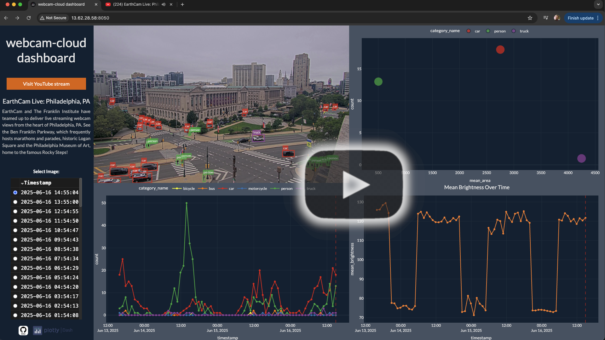
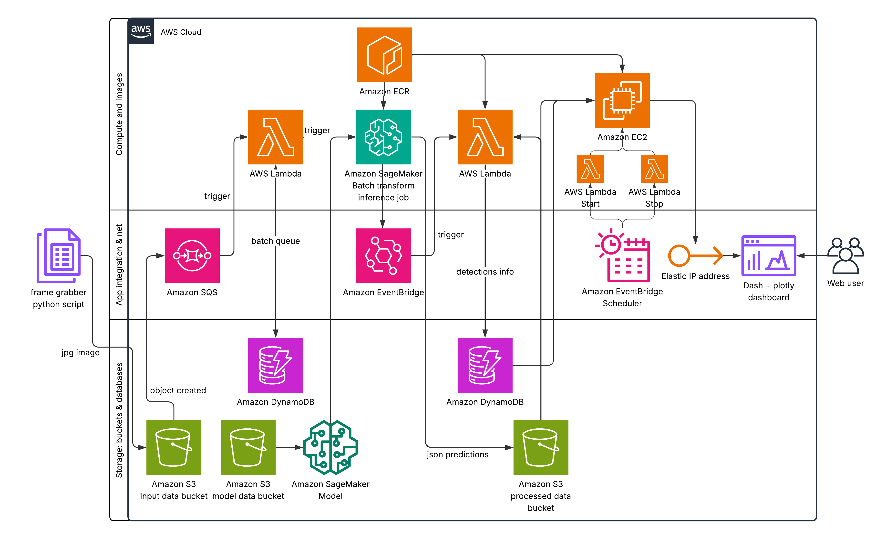

# webcam-cloud


# Overview

This project is intended to learn and refresh the use of selected AWS cloud services, combined with Dash application development. It performs object detection on frames captured from a live YouTube stream and presents the results through a Dash app.

The main features and assumptions are:
- The user starts the frame grabber script by providing a link to the live YouTube stream, along with the number of frames to capture and the time interval.
- Grabbed frames are grouped in order to run an AWS SageMaker batch transform inference job.
- Results are stored as JSON files in an S3 bucket and also recorded in a DynamoDB table.
- The processed results and basic analytics are viewable in the Dash app.
- The data was collected between June 13–16, 2025.

## Live Demo Availability
The Dash app is available at "http:// 13.62.28.58: 8050" (remove spaces) from 10 AM to 4 PM CET on weekdays, until the end of July 2025.


## Demo overview
[](https://github.com/user-attachments/assets/742abf36-b843-4036-a7a8-dc27c07e7b41)


# Architecture
Scheme prepared with Lucidchart presents simplified architecture of the project along with some triggers and data flow.


# Usage

## Prerequisites:

1. AWS IAM user set up
2. Configured AWS CLI client (```aws configure```)
3. Quota > 0 for batch transform job for selected machine type (eg. ml.m5.large) [see Service Quotas @ AWS]
4. Colima (for Mac) and Docker installed
5. Terraform installed
6. uv installed, .venv activated and synced (```uv sync --only-dev```)
7. Environmental variables, eg.:

```
ENV_STREAM_URL="https://www.youtube.com/watch?v=abcdefghijk"
TF_VAR_region="eu-north-1"
TF_VAR_input_bucket="input-bucket"
TF_VAR_processed_bucket="processed-bucket"
TF_VAR_models_bucket="models-bucket"
TF_VAR_aws_account_id="012345678910"
TF_VAR_lambda1="lambda-1-name"
TF_VAR_lambda2="lambda-2-name"
TF_VAR_db_table="table-name"
TF_VAR_obj_det_image="obj-det-image"
TF_VAR_lambda2_image="lambda2-image"
TF_VAR_dash_image="dash-image"
TF_VAR_obj_det_model="object-det-model"
```

Folder names for processed files, unprocessed files and the list of object
categories used in analytics are defined in `modules/constants.py`. Update this
file if you need to customize them. After editing this file, run `make prep_lambda`
to rebuild the Lambda package so that your changes are included.


## Setting everything up

### 1. Prepare SageMaker inference model
```
# Create bucket to store model
aws s3api create-bucket --bucket ${TF_VAR_models_bucket} --region ${TF_VAR_region} --create-bucket-configuration LocationConstraint=${TF_VAR_region} && \

make prep_inference_model
```

### 2. Build Endpoint Docker image and push to ECR
```
# Authenticate Docker to AWS ECR
echo $(aws ecr get-login-password --region $TF_VAR_region) | docker login --username AWS --password-stdin $TF_VAR_aws_account_id.dkr.ecr.$TF_VAR_region.amazonaws.com && \  

echo $(aws ecr get-login-password --region us-east-1 | docker login --username AWS --password-stdin 763104351884.dkr.ecr.us-east-1.amazonaws.com) && \  

make prep_ecr_repo docker_image_name=$TF_VAR_obj_det_image && \
make build_image Dockerfile_name=Dockerfile_Endpoint docker_image_name=$TF_VAR_obj_det_image && \
make push_image docker_image_name=$TF_VAR_obj_det_image
```

### 3. Build Lambda2 Docker image and push to ECR
```
# Authenticate Docker to AWS ECR
echo $(aws ecr get-login-password --region $TF_VAR_region) | docker login --username AWS --password-stdin $TF_VAR_aws_account_id.dkr.ecr.$TF_VAR_region.amazonaws.com && \  

make prep_ecr_repo docker_image_name=$TF_VAR_lambda2_image && \
make build_image Dockerfile_name=Dockerfile_Lambda docker_image_name=$TF_VAR_lambda2_image && \
make push_image docker_image_name=$TF_VAR_lambda2_image
```

### 4. Build EC2 Docker image and push to ECR
```
# Authenticate Docker to AWS ECR
echo $(aws ecr get-login-password --region $TF_VAR_region) | docker login --username AWS --password-stdin $TF_VAR_aws_account_id.dkr.ecr.$TF_VAR_region.amazonaws.com && \  

make prep_ecr_repo docker_image_name=$TF_VAR_dash_image && \
make build_image Dockerfile_name=Dockerfile_EC2 docker_image_name=$TF_VAR_dash_image build_arg="--build-arg TF_VAR_region=$TF_VAR_region \
    --build-arg TF_VAR_db_img_stats_table=$TF_VAR_db_img_stats_table \
    --build-arg TF_VAR_processed_bucket=$TF_VAR_processed_bucket \
    --build-arg ENV_STREAM_URL=$ENV_STREAM_URL" && \
make push_image docker_image_name=$TF_VAR_dash_image
```

### 5. Prepare code for AWS Lambda
```
make prep_lambda
```

### 6. Set up services with Terraform
```
make aws_apply
```

### 7. Run frames grabbing and initialize project
```
uv sync --extra grabber
python modules/grabber.py
```

---
## Issues:
Some most annoying or unexpected issues met during the development:  

I. Custom Docker image for SageMaker batch transform job does not seem to work as expected: Packing code to model.tar.gz is mandatory (see the `prep_inference_model` in the makefile) as the copy of files specified in the Dockerfile seems to be overwritten by the unpacked model artifact [(see GitHub issue).](https://github.com/aws/sagemaker-pytorch-inference-toolkit/issues/61#issuecomment-665980501)  

II. Dash template in lowercase: Using ```from dash_bootstrap_templates import load_figure_template```  on Mac allows to specify template name in uppercase, whereas applied Docker image (```python:3.10-slim-bookworm```) required it to be in lowercase, and it was a pain to find it out.  

III. The ```yt-dlp``` library used to grab video frames from live YouTube streams does not work out of the box on headless browsers (eg. on virtual machines like EC2), hence a local laptop was used for this purpose.

IV. AWS Lambdas need their own base image (eg. `public.ecr.aws/lambda/python:3.10`) and not just one of popular like: ```python:3.10-slim-bookworm```